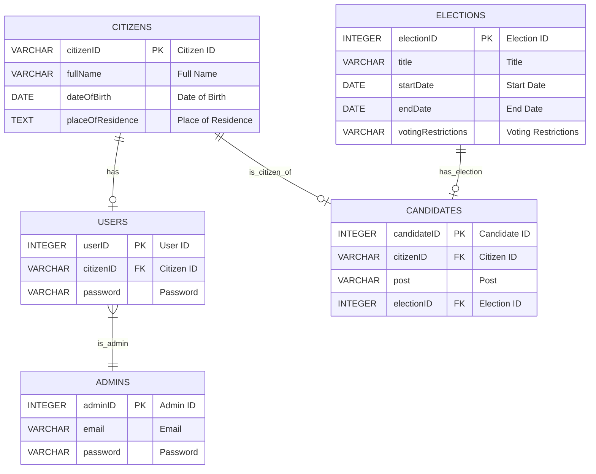
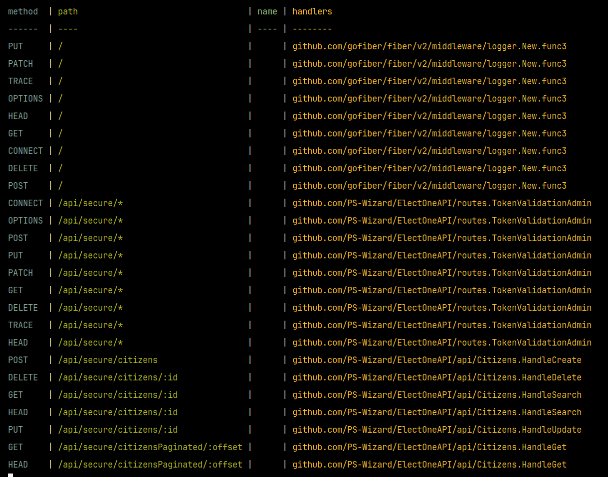

A more secure, and performant port of the previous API.

# TODO: 
- some routes need to be exposed to the user too.
- The `getCandidate`, currently responds with the `citizenID` too, if its admin thats fine, but if the request is from the user, that field needs to stay hidden
- Authentication for `user` and `admin` seperately
    - Different JWT tokens probably
        - After which need to update the middlewares `TokenValidationAdmin` & `TokenValidationUser`
            - Validation of the JWT will probably include:
                - Expiration validation
                - Claims validation
                    - Which although, will probably also be handeled in the "frontend's backend", the one that's gonna handle the routes



### Admins:

| CID | NAME     | TYPE         | NOTNULL | DFLT VALUE | PK |
| --- | -------- | ------------ | ------- | ---------- | --- |
| 0   | adminID  | INTEGER      | 0       | NULL       | 1   |
| 1   | email    | VARCHAR(255) | 1       | NULL       | 0   |
| 2   | password | VARCHAR(255) | 1       | NULL       | 0   |

---

### Citizens:

| CID | NAME              | TYPE         | NOTNULL | DFLT VALUE | PK |
| --- | ----------------- | ------------ | ------- | ---------- | --- |
| 0   | citizenID         | VARCHAR(20)  | 0       | NULL       | 1   |
| 1   | fullName          | VARCHAR(255) | 1       | NULL       | 0   |
| 2   | dateOfBirth       | DATE         | 1       | NULL       | 0   |
| 3   | placeOfResidence  | TEXT         | 1       | NULL       | 0   |

---

### Users:

| CID | NAME      | TYPE         | NOTNULL | DFLT VALUE | PK |
| --- | --------- | ------------ | ------- | ---------- | --- |
| 0   | userID    | INTEGER      | 0       | NULL       | 1   |
| 1   | citizenID | VARCHAR(20)  | 1       | NULL       | 0   |
| 2   | password  | VARCHAR(255) | 1       | NULL       | 0   |

---

### Election:

| CID | NAME               | TYPE         | NOTNULL | DFLT VALUE | PK |
| --- | ------------------ | ------------ | ------- | ---------- | --- |
| 0   | electionID         | INTEGER      | 0       | NULL       | 1   |
| 1   | title              | VARCHAR(255) | 1       | NULL       | 0   |
| 2   | startDate          | DATE         | 1       | NULL       | 0   |
| 3   | endDate            | DATE         | 1       | NULL       | 0   |
| 4   | votingRestrictions | VARCHAR(255) | 1       | NULL       | 0   |

---

### Candidates:

| CID | NAME        | TYPE         | NOTNULL | DFLT VALUE | PK |
| --- | ----------- | ------------ | ------- | ---------- | --- |
| 0   | candidateID | INTEGER      | 0       | NULL       | 1   |
| 1   | citizenID   | VARCHAR(20)  | 1       | NULL       | 0   |
| 2   | post        | VARCHAR(255) | 1       | NULL       | 0   |
| 3   | electionID  | INTEGER      | 1       | NULL       | 0   |
| 4   | GroupName   | TEXT         | 0       | NULL       | 0   |

---

# API Routes and JSON Schema

### **1. GET /api/secure/citizens/:id**
- **Description**: Fetch a citizen by ID.
- **Authorization**: `Bearer adminsecrettoken`
- **URL Params**:
- `id` (string): Citizen's unique ID.
- **Response**:
```json
{
    "citizenID": "12-123-12334",
    "fullName": "Alice Johnson",
    "dateOfBirth": "1995-03-22",
    "placeOfResidence": "Chicago"
}
```

---

### **2. GET /api/secure/citizensPaginated/:offset**
- **Description**: Fetch a paginated list of citizens.
- **Authorization**: `Bearer adminsecrettoken`
- **URL Params**:
- `offset` (int): The offset for pagination (e.g., `0` for first set, `10` for second, etc.).
```json
~
{

    "citizenID": "12-123-12334",
    "fullName": "Alice Johnson",
    "dateOfBirth": "1995-03-22",
    "placeOfResidence": "Chicago"
}
```
---

### **3. POST /api/secure/citizens**
- **Description**: Create a new citizen.
- **Authorization**: `Bearer adminsecrettoken`
- **Request Body**:
```json
{
    "citizenID": "12-123-12334",
    "fullName": "Alice Johnson",
    "dateOfBirth": "1995-03-22",
    "placeOfResidence": "Chicago"
}
```

### **4. PUT /api/secure/citizens/:id**
- **Description**: Update a citizen's details.
- **Authorization**: `Bearer adminsecrettoken`
- **Request Body**:
```json
~
{
  "citizenID": "12-123-12334",
  "fullName": "Alice Johnson Updated",
  "dateOfBirth": "1995-03-22",
  "placeOfResidence": "Chicago"
}
```

### **5. DELETE /api/secure/citizens/:id**
- **Description**: delete a citizen's .
- **Authorization**: `Bearer adminsecrettoken`

---



--- Other Packages Installed:

`ab`: Apache load tester
