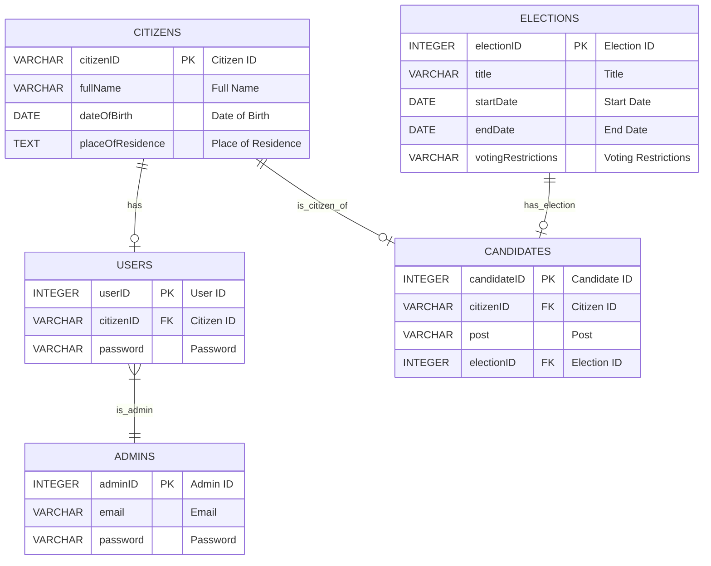
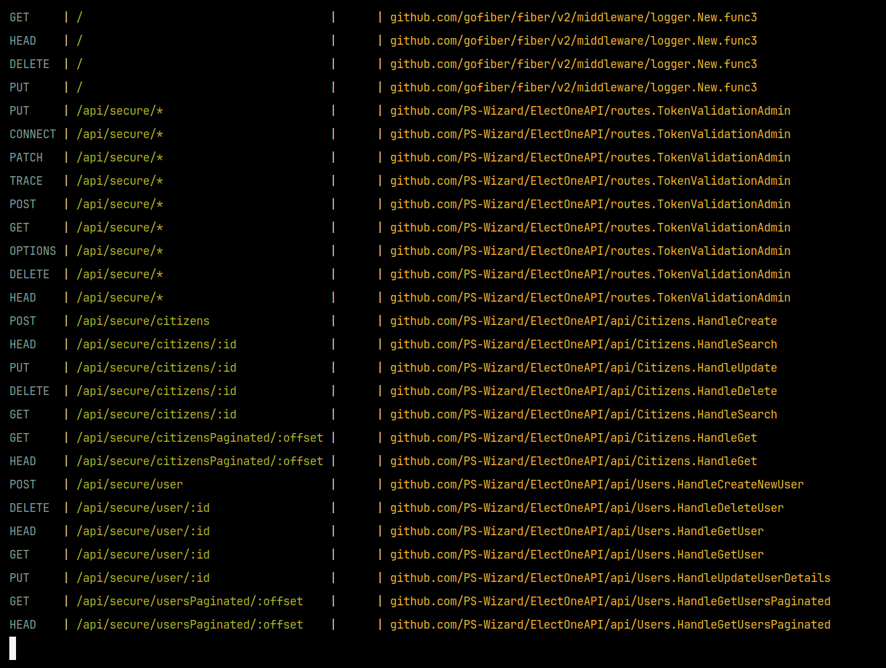

### Admins:

| CID | NAME     | TYPE         | NOTNULL | DFLT VALUE | PK |
| --- | -------- | ------------ | ------- | ---------- | --- |
| 0   | adminID  | INTEGER      | 0       | NULL       | 1   |
| 1   | email    | VARCHAR(255) | 1       | NULL       | 0   |
| 2   | password | VARCHAR(255) | 1       | NULL       | 0   |

---

### Citizens:

| CID | NAME              | TYPE         | NOTNULL | DFLT VALUE | PK |
| --- | ----------------- | ------------ | ------- | ---------- | --- |
| 0   | citizenID         | VARCHAR(20)  | 0       | NULL       | 1   |
| 1   | fullName          | VARCHAR(255) | 1       | NULL       | 0   |
| 2   | dateOfBirth       | DATE         | 1       | NULL       | 0   |
| 3   | placeOfResidence  | TEXT         | 1       | NULL       | 0   |

---

### Users:

| CID | NAME      | TYPE         | NOTNULL | DFLT VALUE | PK |
| --- | --------- | ------------ | ------- | ---------- | --- |
| 0   | userID    | INTEGER      | 0       | NULL       | 1   |
| 1   | citizenID | VARCHAR(20)  | 1       | NULL       | 0   |
| 2   | password  | VARCHAR(255) | 1       | NULL       | 0   |

---

### Election:

| CID | NAME               | TYPE         | NOTNULL | DFLT VALUE | PK |
| --- | ------------------ | ------------ | ------- | ---------- | --- |
| 0   | electionID         | INTEGER      | 0       | NULL       | 1   |
| 1   | title              | VARCHAR(255) | 1       | NULL       | 0   |
| 2   | startDate          | DATE         | 1       | NULL       | 0   |
| 3   | endDate            | DATE         | 1       | NULL       | 0   |
| 4   | votingRestrictions | VARCHAR(255) | 1       | NULL       | 0   |

---

### Candidates:

| CID | NAME        | TYPE         | NOTNULL | DFLT VALUE | PK |
| --- | ----------- | ------------ | ------- | ---------- | --- |
| 0   | candidateID | INTEGER      | 0       | NULL       | 1   |
| 1   | citizenID   | VARCHAR(20)  | 1       | NULL       | 0   |
| 2   | post        | VARCHAR(255) | 1       | NULL       | 0   |
| 3   | electionID  | INTEGER      | 1       | NULL       | 0   |
| 4   | GroupName   | TEXT         | 0       | NULL       | 0   |

---

# API Routes:
[Postman Collection](./rester-export-postman.json)

