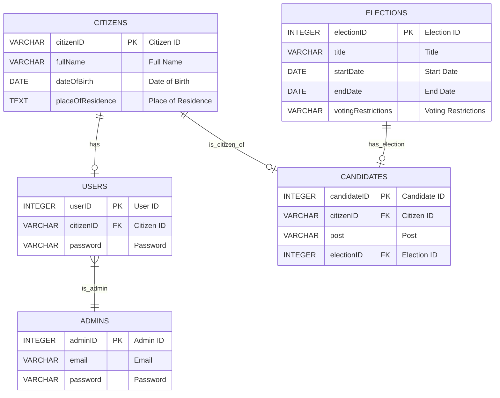

A more secure, and performant port of the previous API.

```mermaid
erDiagram
    CITIZENS {
        VARCHAR citizenID PK "Citizen ID"
        VARCHAR fullName "Full Name"
        DATE dateOfBirth "Date of Birth"
        TEXT placeOfResidence "Place of Residence"
    }
    USERS {
        INTEGER userID PK "User ID"
        VARCHAR citizenID FK "Citizen ID"
        VARCHAR password "Password"
    }
    ADMINS {
        INTEGER adminID PK "Admin ID"
        VARCHAR email "Email"
        VARCHAR password "Password"
    }
    ELECTIONS {
        INTEGER electionID PK "Election ID"
        VARCHAR title "Title"
        DATE startDate "Start Date"
        DATE endDate "End Date"
        VARCHAR votingRestrictions "Voting Restrictions"
    }
    CANDIDATES {
        INTEGER candidateID PK "Candidate ID"
        VARCHAR citizenID FK "Citizen ID"
        VARCHAR post "Post"
        INTEGER electionID FK "Election ID"
    }

    CITIZENS ||--o| USERS : has
    CITIZENS ||--o| CANDIDATES : is_citizen_of
    ELECTIONS ||--o| CANDIDATES : has_election
    USERS }|--|| ADMINS : is_admin
```
